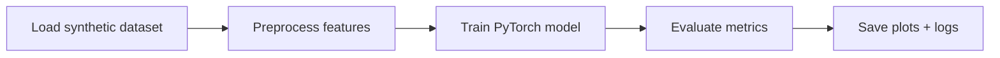

# Pytorch Regression Baseline


Student-friendly PyTorch baseline focused on reproducible training and clear documentation.

## Dataset Information
Synthetic regression dataset generated with `sklearn.datasets.make_regression` (3200 samples, 25 features, noise=12.0).

## How to Run
```bash
python -m venv .venv
source .venv/bin/activate
pip install -r requirements.txt
python train.py
```

## What this run produces
- `results/metrics.json`
- `results/run_log.txt`
- Visual outputs under `results/`

### Visuals Included
- Predicted vs Actual scatter plot
- Loss curve (train vs validation)

## Notes for Students
- Start by reading `train.py` top to bottom.
- Change one hyperparameter at a time.
- Track metric changes in `results/metrics.json`.




## Advanced Student Track

For students who want to move beyond a baseline script, this repo now includes:

- `train_advanced.py` (regularization + scheduler + early stopping + k-fold CV)
- `ADVANCED_CONCEPTS.md` (concept-by-concept explanation)

Run:

```bash
python train_advanced.py
```

Outputs `advanced_metrics.json` with both holdout and cross-validation results.
